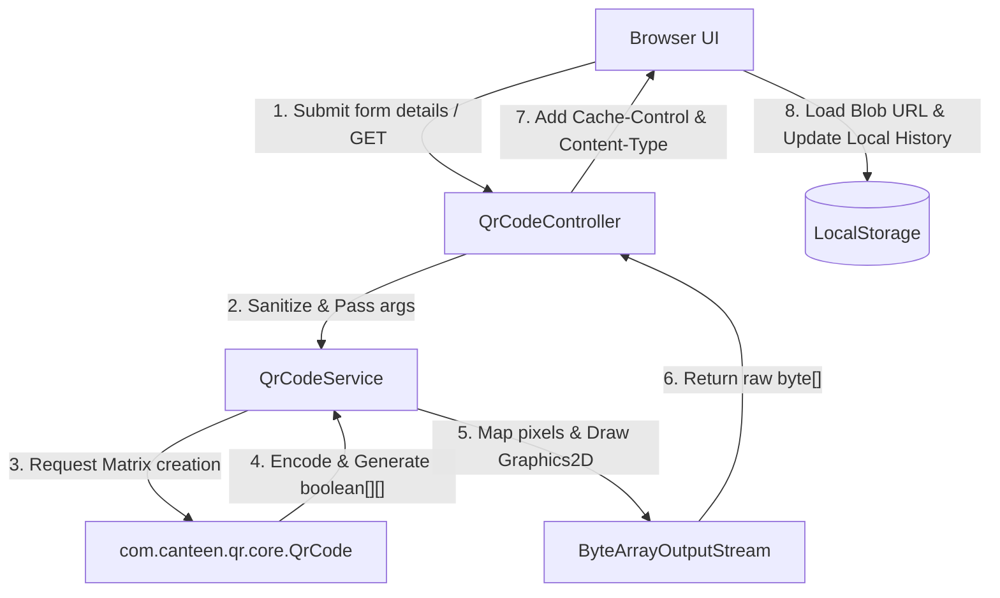

# QR Studio - Technical Details & Architecture

This document provides a comprehensive technical breakdown of **QR Studio**’s architecture, algorithms, implementation details, and frontend integrations.

---

## System Architecture

The application is structured as a single-instance Spring Boot microservice. The client interacts with the backend solely through an optimized HTTP REST API. Static assets (HTML, CSS, JS) are packaged inside the Java JAR and served by Tomcat.



---

## 1. Backend Implementation

### Main Entrypoint: [QrCodeApplication.java](file:///Users/satwikpoddar/devlopment/java-project/canteen/src/main/java/com/canteen/qr/QrCodeApplication.java)
A standard Spring Boot application launcher.

### Core Processing: [QrCodeService.java](file:///Users/satwikpoddar/devlopment/java-project/canteen/src/main/java/com/canteen/qr/service/QrCodeService.java)
The service utilizes our custom in-house implementation to encode data, custom-style the output canvas, and serialize the binary image using standard `java.awt.Graphics2D`.

#### Step 1: Core Mathematical Encoding (In-House Algorithm)
We replaced third-party dependencies with our own native implementation located in `com.canteen.qr.core`.
The `QrCode.encodeText()` method handles the heavy lifting:
- Converts the string to a sequence of `QrSegment` chunks (byte-mode encoding).
- Calculates the necessary version (size) and bits.
- Computes **Reed-Solomon Error Correction** codewords utilizing Galois Field (GF) arithmetic.
- Assembles the raw data bit-stream.

#### Step 2: Matrix Placement and Masking
The custom `QrCode` class allocates a 2D boolean array:
```java
public boolean getModule(int x, int y);
```
It draws the Finder Patterns, Alignment Patterns, and Timing Patterns. Finally, it calculates penalty scores for all 8 standard QR mask patterns and applies the mask that scores the lowest (i.e. the most readable mask).

#### Step 3: Color Translation & Graphics Rendering
Our custom parsing algorithm `parseColor` translates standard browser hex inputs (like `#6366F1`) into 32-bit ARGB integers:
```java
int onColorArgb = parseColor(onColorHex, 0xFF000000);
```
The boolean matrix is scaled and mapped pixel-by-pixel onto a `java.awt.image.BufferedImage` using the powerful Java 2D API:
```java
Graphics2D g2d = image.createGraphics();
g2d.setColor(new Color(onColorArgb, true));
// Loop over array and g2d.fillRect(...)
```
The finalized canvas is exported using `ImageIO`.

---

## 2. Frontend Implementation

### Style Architecture: [style.css](file:///Users/satwikpoddar/devlopment/java-project/canteen/src/main/resources/static/css/style.css)
The page implements high-fidelity glassmorphism with responsive layout rules:
- **Design Tokens**: Centralized variables (`:root`) dictate standard fonts (`Outfit`, `Inter`).
- **Ambient Lighting**: Animated background circles utilize blur filters (`filter: blur(140px)`) and CSS animations.

### Client-side Logic: [app.js](file:///Users/satwikpoddar/devlopment/java-project/canteen/src/main/resources/static/js/app.js)

#### Binary Stream Caching (Blob URLs)
Rather than rendering base64 strings directly in HTML (which inflates bandwidth by ~33%), the UI reads the raw response stream as a JavaScript `Blob` object, then instantiates a temporary, local Browser Object URL:
```javascript
const blob = await response.blob();
currentQrBlobUrl = URL.createObjectURL(blob);
qrImage.src = currentQrBlobUrl;
```
To avoid memory leaks, the previous Blob URL is garbage-collected using:
```javascript
if (currentQrBlobUrl) {
    URL.revokeObjectURL(currentQrBlobUrl);
}
```

#### Session History Integration
When a user clicks "Generate", the metadata properties are cached inside a LocalStorage array keyed `qr_studio_history`.
- History displays a 100x100px thumbnail generated dynamically by querying the API on load, ensuring memory foot-prints remain tiny.
- Clicking a history item populates the settings form and triggers a standard submit cycle, rebuilding the preview instantly.
