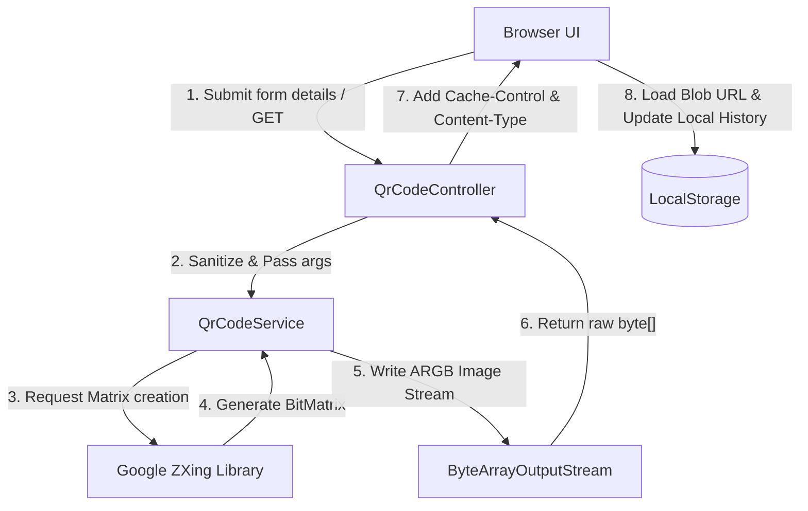

# QR Studio - Technical Details & Architecture

This document provides a comprehensive technical breakdown of **QR Studio**’s architecture, algorithms, implementation details, and frontend integrations.

---

## System Architecture

The application is structured as a single-instance Spring Boot microservice. The client interacts with the backend solely through an optimized HTTP REST API. Static assets (HTML, CSS, JS) are packaged inside the Java JAR and served by Tomcat.



---

## 1. Backend Implementation

### Main Entrypoint: [QrCodeApplication.java](file:///Users/satwikpoddar/devlopment/java-project/canteen/src/main/java/com/canteen/qr/QrCodeApplication.java)
A standard Spring Boot application launcher. The annotations trigger auto-configuration, component scanning, and web application startup:
```java
@SpringBootApplication
public class QrCodeApplication {
    public static void main(String[] args) {
        SpringApplication.run(QrCodeApplication.class, args);
    }
}
```

### Transport Layer: [QrCodeController.java](file:///Users/satwikpoddar/devlopment/java-project/canteen/src/main/java/com/canteen/qr/controller/QrCodeController.java)
The controller exposes the HTTP endpoint `GET /api/qr/generate`. Key design features include:
1. **Query Parameterization**: Accepts parameters: `text`, `width`, `height`, `ecl` (Error Correction Level), `format`, `onColor` (hex code), and `offColor` (hex code).
2. **Dimension Sanitization**: Restricts maximum/minimum heights and widths between 10px and 2000px using:
   ```java
   int finalWidth = Math.max(10, Math.min(width, 2000));
   ```
   This prevents Out-Of-Memory (OOM) heap exceptions caused by malicious client requests demanding excessively large canvas dimensions.
3. **MIME Mapping**: Inspects the `format` parameter and assigns the correct Spring `MediaType` header (`image/png` or `image/jpeg`).
4. **HTTP Caching**: Sets the HTTP `Cache-Control` header to `max-age=31536000, must-revalidate` (1 year). Since QR codes with the exact same inputs are idempotent, this optimizes downstream client page reloads.

### Core Processing: [QrCodeService.java](file:///Users/satwikpoddar/devlopment/java-project/canteen/src/main/java/com/canteen/qr/service/QrCodeService.java)
The service encapsulates Google ZXing libraries to encode data, custom-style the output canvas, and serialize the binary image.

#### Step 1: Configuring Encoding Hints
ZXing encodes using configurations set in a `Map<EncodeHintType, Object>`. We set:
- `CHARACTER_SET` = `UTF-8` to support unicode data, emoji, and multi-language strings.
- `MARGIN` = `1` (quiet zone sizing) to reduce unnecessary white spacing around the modules while maintaining standard-compliant scan padding.
- `ERROR_CORRECTION` = Map parameter mapping to `ErrorCorrectionLevel` enums (`L`, `M`, `Q`, `H`).

#### Step 2: The Core QR Matrix Encoding
A `MultiFormatWriter` takes inputs and creates a `BitMatrix`. The `BitMatrix` is an internal ZXing representation containing boolean values representing the grid modules (pixels):
```java
MultiFormatWriter writer = new MultiFormatWriter();
BitMatrix bitMatrix = writer.encode(text, BarcodeFormat.QR_CODE, width, height, hints);
```

#### Step 3: Color Translation (Hex to 32-bit ARGB Integer)
ZXing's `MatrixToImageConfig` requires color inputs represented as standard signed 32-bit integers in **ARGB format** (`0xAARRGGBB`).
Browsers output standard RGB hex strings (e.g. `#6366F1` or `#FFFFFF`).
Our custom parsing algorithm `parseColor` translates these values:
```java
private int parseColor(String hex, int defaultColor) {
    if (hex == null || hex.trim().isEmpty()) {
        return defaultColor;
    }
    String cleanHex = hex.trim();
    if (cleanHex.startsWith("#")) {
        cleanHex = cleanHex.substring(1);
    }
    if (cleanHex.length() == 6) {
        // We prepend 'FF' to enforce 100% opacity (alpha)
        return (int) Long.parseLong("FF" + cleanHex, 16);
    } else if (cleanHex.length() == 8) {
        return (int) Long.parseLong(cleanHex, 16);
    }
    return defaultColor;
}
```

#### Step 4: Rendering and Binary Stream Extraction
We feed the `BitMatrix`, output format, color configuration, and a `ByteArrayOutputStream` into `MatrixToImageWriter`:
```java
ByteArrayOutputStream outputStream = new ByteArrayOutputStream();
MatrixToImageConfig config = new MatrixToImageConfig(onColor, offColor);
MatrixToImageWriter.writeToStream(bitMatrix, imageFormat, outputStream, config);
return outputStream.toByteArray();
```

---

## 2. Frontend Implementation

### Style Architecture: [style.css](file:///Users/satwikpoddar/devlopment/java-project/canteen/src/main/resources/static/css/style.css)
The page implements high-fidelity glassmorphism with responsive layout rules:
- **Design Tokens**: Centralized variables (`:root`) dictate standard fonts (`Outfit`, `Inter`), spacing, and primary colors.
- **Ambient Lighting**: Animated background circles utilize blur filters (`filter: blur(140px)`) and CSS animations to create a floating glow.
- **Glass Card Mechanics**: Translucent cards combine background alphas (`rgba(22, 28, 45, 0.45)`) and thin borders (`1px solid rgba(255, 255, 255, 0.08)`) with `backdrop-filter: blur(16px)` to integrate background lighting.

### Client-side Logic: [app.js](file:///Users/satwikpoddar/devlopment/java-project/canteen/src/main/resources/static/js/app.js)
The JS controller orchestrates event management and processes binary data.

#### Binary Stream Caching (Blob URLs)
Rather than rendering base64 strings directly in HTML (which inflates bandwidth by ~33%), the UI reads the raw response stream as a JavaScript `Blob` object, then instantiates a temporary, local Browser Object URL:
```javascript
const blob = await response.blob();
currentQrBlobUrl = URL.createObjectURL(blob);
qrImage.src = currentQrBlobUrl;
```
To avoid memory leaks, the previous Blob URL is garbage-collected using:
```javascript
if (currentQrBlobUrl) {
    URL.revokeObjectURL(currentQrBlobUrl);
}
```

#### Session History Integration
When a user clicks "Generate", the metadata properties are cached inside a LocalStorage array keyed `qr_studio_history`.
- History displays a 100x100px thumbnail generated dynamically by querying the API on load, ensuring memory foot-prints remain tiny.
- Clicking a history item populates the settings form and triggers a standard submit cycle, rebuilding the preview instantly.
